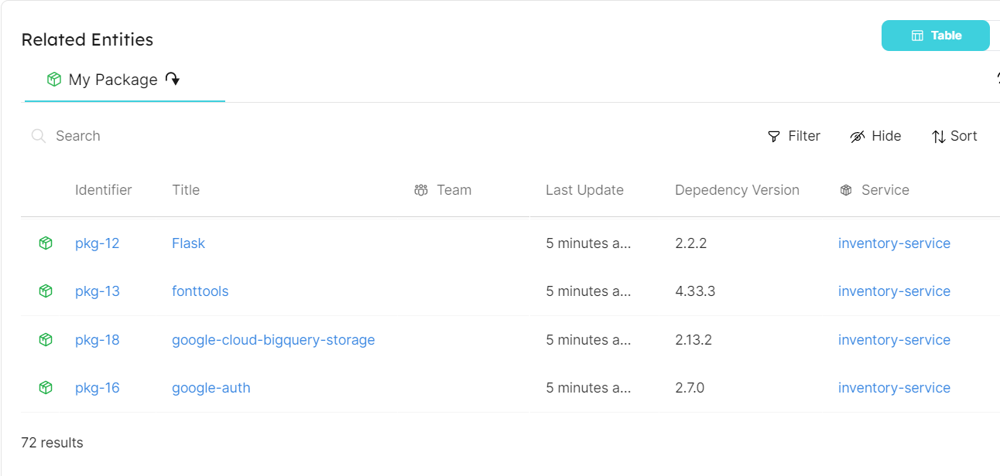

# Ingesting Package.JSON Dependencies

## Getting started

In this example you will create a blueprint for `package` entity that ingests all third party dependencies in your package.json file using a combination of REST API and Webhook. You will then relate this `package` blueprint to a `service` blueprint, allowing you to display all the packages used by a service. Also, you will add some python script to transform your package file into a format required by the webhook (which is mostly JSON Array for the `dependencies` property). Finally, you will configure your Gitlab to create/update your entities in Port every time a GitLab CI is triggered by a schedule.

## Service Blueprint
Create the service blueprint in Port [using this json file](./resources/service.md)

## Package Blueprint
Create the package blueprint in Port [using this json file](./resources/package.md)

## Package Webhook Configuration
Use the [webhook configuration file](./resources/package_webhook_configuration.md) to create your Port webhook. 

Follow the example guide on how to [create a Port webhook](https://docs.getport.io/build-your-software-catalog/sync-data-to-catalog/webhook/#configuring-webhook-endpoints). You will then use the webhook URL to ingest data to Port via REST API.

### Gitlab CI yaml
Place this example `.gitlab-ci.yml` file in your project's root folder

### Gitlab CI Variables
To interact with Port using Gitlab CI Pipeline, you will first need to define your Port credentials [as variables for your pipeline](https://docs.gitlab.com/ee/ci/variables/index.html#define-a-cicd-variable-in-the-ui). Then, pass the defined variables to your ci pipeline script. Ensure that the SERVICE_ID variable exists as an identifier in your port `service` blueprint.

The list of the required variables to run this pipeline are:
- `SERVICE_ID`
- `WEBHOOK_URL`
- `PATH_TO_PACKAGE_JSON_FILE`

### Schedule the script
1. Go to your Gitlab project and select CI/CD
2. Click on **Schedules** and create new schedule
3. Enter the necessary information into the form: the Description, Interval Pattern, Timezone, Target branch and other variables specifically for the schedule.
4. Click on **Save pipeline schedule** 

#### Screenshot - Package Entity Created

